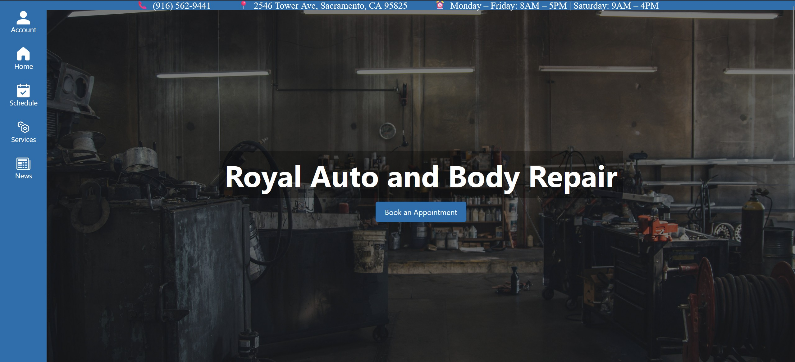
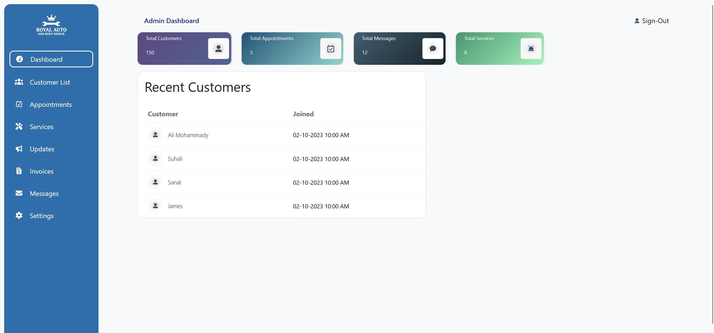
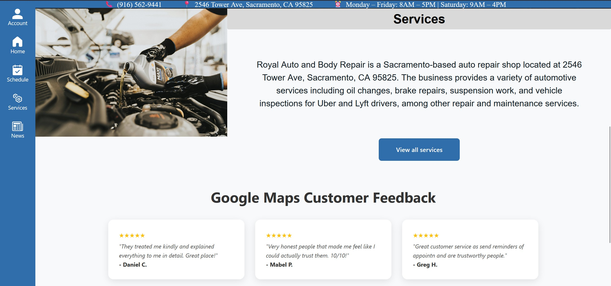
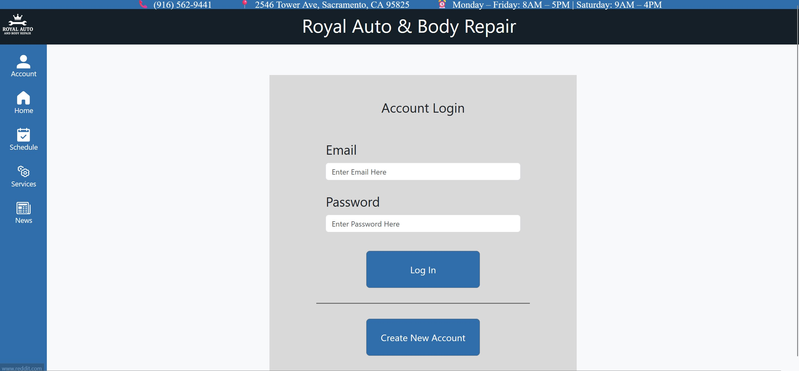
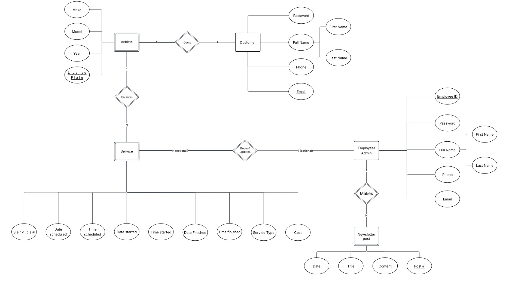

# Royal Website


## Synopsis

The Royal Auto & Body Repair Website is a full-stack web application built to bring the shop’s services and operations online. Right now, the business has no website at all, so our goal is to create a modern, easy-to-use platform that improves both the customer experience and the workflow for the shop’s staff.

On the customer side, the site allows people to browse services, create an account, manage their vehicles, and schedule appointments directly online. For staff, the admin dashboard provides secure tools to view and update customer profiles, track upcoming appointments, manage service descriptions, post shop updates, and handle customer messages, all in one place.

The system uses React on the frontend and Django with a MySQL database on the backend, with reusable UI components and divided client/admin portals to keep everything organized and easy to maintain. Overall, this project modernizes how Royal Auto & Body Repair interacts with its customers and helps streamline the day-to-day operations inside the shop.

## Features

### 1.Business Information

**a. Home Page**
- Includes contact information
  - Phone number, address, and business hours
  - Appropriate links to the rest of the site
- Includes section for connection to customer reviews
- Includes small services section

**b. Payment Options Offered**
- Zelle
- Cash
- Debit
- Credit

### 2. Creating Customer Profiles

**a. Customer Information**
- Includes the contact info: name, phone number, and email of customers

**b. Vehicle management**
- List of work done
  - Customers should be able to see previous work done on their vehicle
- Recommend upcoming services
  - Customers should see a list of possible future services as recommended by the shop
- Checklist for services

### 3. Display Services Offered

**a. List of services provided**
- Oil change
- Brakes
- Suspensions
- Engine tune-up
- Body work (from partner shop)
- Transmission
- Hybrids

**b. Services and vehicles will be detailed to reflect what customers can expect to request**

**c. Services should reflect an approximate cost of ther service provided**

### 4. Admin Dashboard

**a. View all list of customers/accounts**

**b. View upcoming appointments**

**c. Edit description of services, or add new services**

**d. Add and edit news/updates**

**e. Customer messages**
- View and send messages

## Tech Stack

The Royal Auto & Body Repair website is built using a modern full-stack architecture designed for maintainability, performance, and scalability.

### Frontend

**React 18**  
- Component-based UI for both customer and admin portals  
- Reusable layouts for services, vehicles, appointments, and dashboards  

**Bootstrap 5**  
- Ensures responsive and consistent styling across devices  

**React Router**  
- Provides smooth navigation between pages  

**Create React App (CRA)**  
- Handles bundling, compilation, hot reload, and the development server  
- Organized folder structure for scalable growth  

### Backend

**Django Framework**  
- REST-style endpoints powering all core features (authentication, profiles, vehicles, services, appointments, messages)  
- Built-in security features such as CSRF protection and input validation  

**Django Models + Views**  
- Clean separation between business logic and data representation  

### Database

**MySQL**  
- Relational database used for all persistent data  
- Matches the ERD for customers, vehicles, services, appointments, and messages  

### APIs / External Services

**Google Reviews API (Free Tier)**  
- Displays real customer reviews directly on the homepage  

**Bootstrap CDN**  
- Provides fast-loading UI components  

## Project Structure

```
RoyalWebsite/
├── backend/
│   ├── backend/            # Django project configuration (settings, urls, wsgi, asgi)
│   ├── core/               # Main Django app (views, models, admin, etc.)
│   ├── manage.py           # Django management script
│   └── requirements.txt    # Python dependencies for backend
│
├── frontend/
│   ├── public/             # Base HTML template and static assets
│   └── src/
│       ├── Components/     # Reusable React components
│       ├── Pages/          # Top-level React pages (routing targets)
│       ├── images/         # Frontend images (logos, graphics)
│       ├── App.js          # Main React component
│       ├── App.css         # Global styles
│       ├── index.js        # React entry point
│       └── index.css       # Base CSS styling
│
└── README.md               # Project documentation
```

## Images & Media
Some screenshots to showcase the visual theme of the project.

 

 

The ERD for our project's handling of database entities.



## Roadmap (Based on JIRA)

| Sprint | Major Stories | Estimated Completion |
|--------|----------------|-----------------------|
| Sprint 5 | Customer account creation | 02/07/26 |
| Sprint 6 | customer account management | 02/21/26 |
| Sprint 7 | appointments | 03/07/26 |
| Sprint 8 | admin dashboard pt1 | 03/21/26 |
| Sprint 9 | admin dashboard pt2 | 04/04/26 |

## Developer Instructions

## Testing

## Deployment

## Team Members

 MadelynAnne Kirkman\
 Najaf Ali Mohammady\
 Erik Contreras\
 Henry Muentz\
 Trevor Gould\
 Ilai Sirak\
 Tucker Oakes\
 David Meltonyan

 ## License

 This project is proprietary, and the property of Royal Auto and Body Repair.
 The dev team maintains nominal ownership of the project until end of development.
 The CSUS Computer Science Department reserves the right to use the documentation and product as examples of student work.
