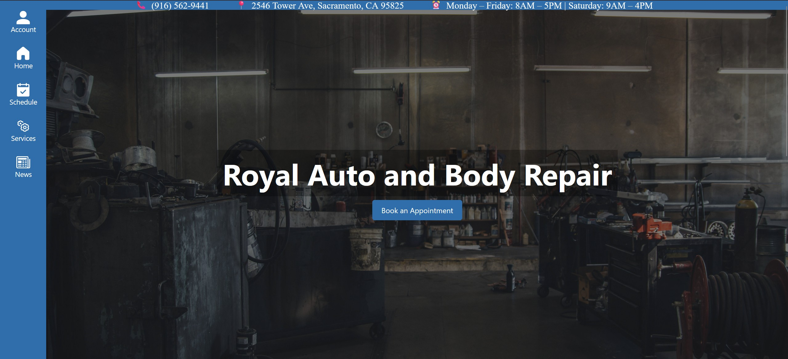
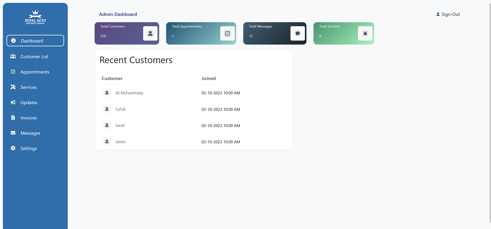
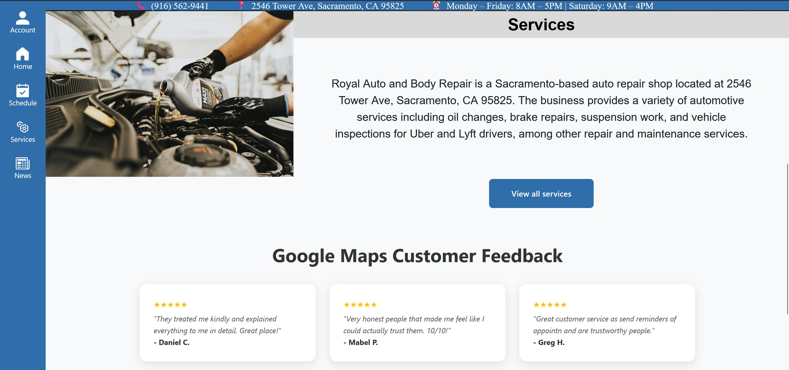
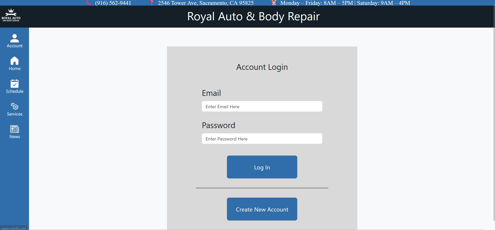
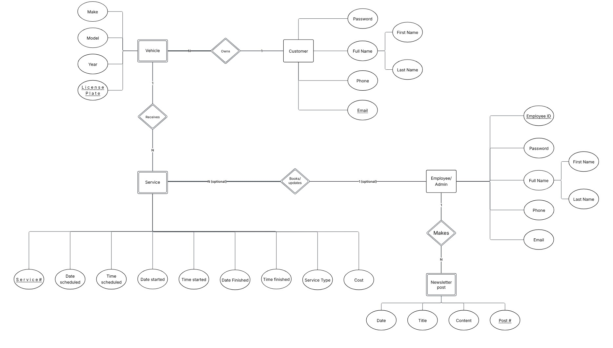

# Royal Website


## Synopsis

The Royal Auto & Body Repair Website is a full-stack web application built to give the business an online presence. This software was created as a modern, easy-to-use platform that improves both the customer experience and staff daily workflow.

On the customer side, the site gives cusotomers a quick view of contact and location information, and an easy way to contact the business with any questions they may have. This site also allows users to browse services, create an account, manage their vehicles, schedule appointments, and view news and updates about the business. For staff, the admin dashboard provides secure tools to view and update customer profiles, track upcoming appointments, manage customer invoices, maintain offered services and their descriptions, and handle customer messages, all in one place.

The system combines a React frontend, Django backend, and MySQL database, with reusable UI components and divided client/admin portals to keep everything organized and easy to maintain. Overall, this project modernizes how Royal Auto & Body Repair interacts with its customers and helps streamline the day-to-day operations inside the shop.

## Features

### 1.Business Information

**a. Home Page**
- Includes contact information
  - Phone number, address, and business hours
  - Appropriate links to the rest of the site
- Includes section for connection to customer reviews
- Includes small services section

**b. Payment Options Offered**
- Zelle
- Cash
- Debit
- Credit

### 2. Creating Customer Profiles

**a. Customer Information**
- Includes the contact info: name, phone number, and email of customers

**b. Vehicle management**
- List of work done
  - Customers should be able to see previous work done on their vehicle
- Recommend upcoming services
  - Customers should see a list of possible future services as recommended by the shop
- Checklist for services

### 3. Display Services Offered

**a. List of services provided**
- Oil change
- Brakes
- Suspensions
- Engine tune-up
- Body work (from partner shop)
- Transmission
- Hybrids

**b. Services and vehicles will be detailed to reflect what customers can expect to request**

**c. Services should reflect an approximate cost of ther service provided**

### 4. Admin Dashboard

**a. View all list of customers/accounts**

**b. View upcoming appointments**

**c. Edit description of services, or add new services**

**d. Add and edit news/updates**

**e. Customer messages**
- View and send messages

## Tech Stack

The Royal Auto & Body Repair website is built using a modern full-stack architecture designed for maintainability, performance, and scalability.

### Frontend

**React 18**  
- Component-based UI for both customer and admin portals  
- Reusable layouts for services, vehicles, appointments, and dashboards  

**Bootstrap 5**  
- Ensures responsive and consistent styling across devices  

**React Router**  
- Provides smooth navigation between pages  

**Create React App (CRA)**  
- Handles bundling, compilation, hot reload, and the development server  
- Organized folder structure for scalable growth  

### Backend

**Django Framework**  
- REST-style endpoints powering all core features (authentication, profiles, vehicles, services, appointments, messages)  
- Built-in security features such as CSRF protection and input validation  

**Django Models + Views**  
- Clean separation between business logic and data representation  

### Database

**MySQL**  
- Relational database used for all persistent data  
- Matches the ERD for customers, vehicles, services, appointments, and messages  

### APIs / External Services

**Google Reviews API (Free Tier)**  
- Displays real customer reviews directly on the homepage  

**Bootstrap CDN**  
- Provides fast-loading UI components  

## Project Structure

```
RoyalWebsite/
├── backend/
│   ├── backend/            # Django project configuration (settings, urls, wsgi, asgi)
│   ├── core/               # Main Django application (views, models, serializers, admin, etc.)
│   │   └── migrations/     # Database schema migration/version control files
│   ├── manage.py           # Django management script
│   └── requirements.txt    # Backend Python dependencies
│
├── docker/
│   └── mysql/
│       └── init.sql        # MySQL initialization script for Docker setup
│
├── frontend/
│   ├── public/             # React base HTML template and public static assets
│   │   └── images/
│   │       └── services/   # Service images referenced by database records
│   │
│   ├── src/
│   │   ├── Components/     # Reusable React components
│   │   ├── Pages/          # Top-level routed application pages
│   │   │   └── AdminPages/ # Admin and employee-only pages
│   │   ├── images/         # Frontend-only images and graphics
│   │   ├── context/        # Shared React context providers and state helpers
│   │   ├── __tests__/      # Frontend test files
│   │   ├── __mocks__/      # Mock files used during testing
│   │   ├── Testing/        # Additional frontend testing utilities/files
│   │   ├── App.js          # Root React component
│   │   ├── App.css         # Global application styling
│   │   ├── index.js        # React application entry point
│   │   └── index.css       # Base CSS styling
│   │
│   └── package.json        # Frontend dependencies and React scripts
│
├── docker-compose.yml      # Main Docker Compose configuration
└── README.md               # Project documentation
```

## Images & Media
Some screenshots to showcase the visual theme of the project.

 

 

The ERD for our project's handling of database entities.



## Roadmap (Based on JIRA)

| Sprint | Major Stories | Estimated Completion |
|--------|----------------|-----------------------|
| Sprint 5 | Customer account creation | 02/07/26 |
| Sprint 6 | customer account management | 02/21/26 |
| Sprint 7 | appointments | 03/07/26 |
| Sprint 8 | admin dashboard pt1 | 03/21/26 |
| Sprint 9 | admin dashboard pt2 | 04/04/26 |

## Developer Instructions

## Testing
### System Requirements:

- Docker Desktop (latest stable)
- Python: v3.11 or newer (recommended: 3.13)
- Node.js: v18 LTS or newer (npm v9+)
- Git

### Stack versions used by this project:

- Django: v5.x (with Django REST Framework + SimpleJWT)
- React: v18.3.1
- react-router-dom: v7.13.1
- react-scripts (CRA): v5.0.1
- @testing-library/react: v16.3.0
- @testing-library/user-event: v14.6.1
- MySQL: v8.0 (via Docker image mysql:8.0)

### To set up to run tests on your machine

#### Clone the GitHub repository by running the following command:

- git clone <repository-url> RoyalWebsite

#### Move into the project root:

- cd RoyalWebsite

#### Start the MySQL database container with Docker. Make sure Docker Desktop is running, then:

- docker-compose up -d

This launches a MySQL 8.0 container named royal_mysql on port 3306 with database RoyalWebsite (root password: Root). The schema in init.sql is loaded automatically the first time the container is created.

Add a .env file to the backend directory containing any required secrets (Django SECRET_KEY, Facebook tokens, email credentials, etc.). This file will be provided separately.
Please Note: The .env file contains sensitive information and should not be committed to GitHub.

#### Backend (Django): From the project root open a new terminal and run:

- cd backend
- pip install -r requirements.txt

#### Apply database migrations:

- python manage.py migrate

#### Start the Django development server:

- python manage.py runserver

The API will be available at http://localhost:8000.

#### Frontend (React): Open another terminal at the project root and run:

- cd frontend
- npm install

#### Start the React development server:

- npm start

The app will open at http://localhost:3000 and proxies API calls to http://localhost:8000.

### Running Tests:

#### To run all frontend tests:

- cd frontend
- npm test

By default, this runs in interactive watch mode. 

#### To run all tests once (non-interactive, for CI):

- npm test -- --watchAll=false

#### To run a specific test file, pass part of the filename. For example, to run ServicesManagement.test.js:

- npm test ServicesManagement

#### To run with a coverage report:

- npm run test:coverage

### Stopping the Stack:

#### Stop the React dev server and Django server with Ctrl+C in their respective terminals.

#### Stop and remove the MySQL container:

- docker-compose down

#### To also delete the database volume (wipes all data):

- docker-compose down -v


## Deployment

## Team Members

 MadelynAnne Kirkman\
 Najaf Ali Mohammady\
 Erik Contreras\
 Henry Muentz\
 Trevor Gould\
 Ilai Sirak\
 Tucker Oakes\
 David Meltonyan

 ## License

 This project is proprietary, and the property of Royal Auto and Body Repair.
 The dev team maintains nominal ownership of the project until end of development.
 The CSUS Computer Science Department reserves the right to use the documentation and product as examples of student work.
